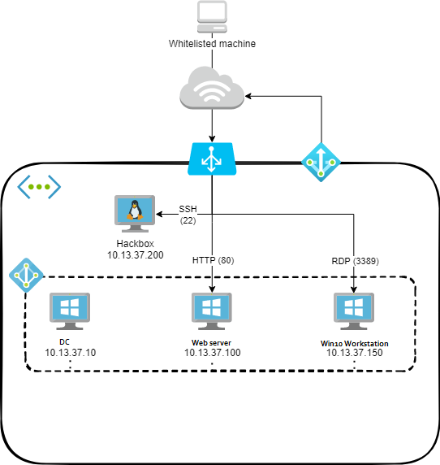

# ADLab
_By [@eh_ctf_group5](https://twitter.com/eh_ctf_group5)_
Video tutorial on https://youtu.be/H76WtmP2Je4

_Based heavily on the work of [@chvancooten](https://twitter.com/chvancooten), Ansible role for Elastic Security deployment by [@nodauf](https://twitter.com/nodauf)_

Provisioning scripts for an Active Directory lab environment. Designed to be deployed to Azure.

## Setup

The lab is provisioned automatically using Terraform and Ansible. First, Terraform deploys all the infrastructure and prepares the machines for provisioning. It then kicks off a role-based Ansible playbook from the Debian attacker machine to provision the Windows-based machines. The full process takes about 15 to 20 minutes to complete.

> 💸 **Note:** The machine sizes are moderately small by default ('Standard_B1ms'). For better performence, use Standard_B2ms or Standard_B4ms. With the latter, the bill will be approx. €10 per day of active use, your mileage may vary. Change the appropriate 'size' settings in `terraform.tfvars` to change machine sizes.

### Deployment

- Clone the repo to your Azure cloud shell. It conveniently has all you need (Terraform and an authenticated Azure provider). Alternatively, install and configure Terraform and the Azure provider yourself. Ansible is installed automatically as part of the provisioning process.
- Copy `terraform.tfvars.example` to `terraform.tfvars` in the `Terraform` directory, and configure the variables appropriately.
- In the same directory, run `terraform init`.
- When you're ready to deploy, run `terraform apply` (or `terraform apply --auto-approve` to skip the approval check).

Once deployment and provisioning have finished, the output variables (public IP / DNS name, administrative passwords, machine names, etc.) will be displayed. You are now ready to connect to the labs!

### Removal

- When you're done with the labs, run `terraform destroy` to tear down the environment.

## Labs

The labs consist of a selection of machines:

- Windows Server 2016 DC
    - Active Directory Certificate Services (ADCS) installed
- Windows Server 2019
    - Internet Information Services (IIS) web server with simple vulnerable app
- Windows 10 client
- Debian attacker box

One public IP is exposed for the whole lab. The IP ranges defined in the `ip-whitelist` are allowed to access the following ports on this IP address, which are bound to the following services using a load balancer:

- Port 22   -> Attacker machine SSH
- Port 80   -> Windows Server 2019 IIS web server with vulnerable page
- Port 3389 -> Windows 10 Client RDP

Another public IP is used for outbound Internet connectivity for all lab machines.
